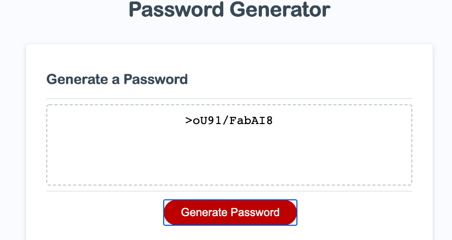

## Homework three- Password Generator 

## Description:

This assignment I had to create an application on how someone can generate a random password. I added uppercase, lowercase, symbols and numbers to go into the random password. When you click on "Generate Password" - the first question that will appear is how many characters do you want in your password. You can only pick 8-128 characters. If you pick something outside of that range it will say length is less than 8 or greater than 128. After you say a number between 8-128 then it will ask if you want lower, upper, symbols and numbers. You can pick on what you want an it will generate! If you just pick how many numbers and no characters it will say "You must pick an option to generate password".

## Password with 12 characters:

